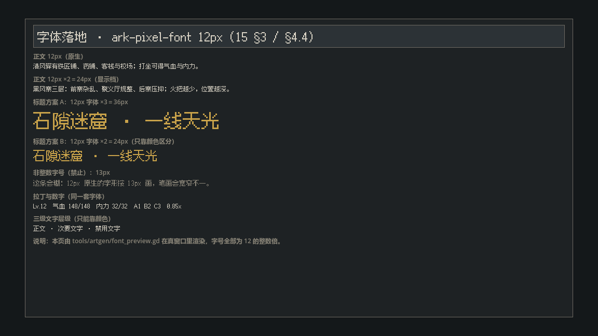

# 中文字体（墨色江湖）

15_美术风格需求 §3「字体要先落地」那一条的落地物。**中文字形是像素风的前置条件**：
字体不到位，整套界面会退回系统字体，图再像素也没用。



试排图由 `tools/artgen/font_preview.gd` 在**真窗口**里渲出来（headless 抓不到字形），
里面把两档字号、拉丁与数字、三级文字颜色并排摆了一遍——顺带把「12px 原生的字按 13px 画会糊」
这件事也摆出来了（同一页里对比着看，比读十遍规范直观）。

## 装了什么

`ark-pixel-font` 12px 比例版，取拉丁／简体／繁体三份（日文、韩文没取：我们不做那两语的文本）：

| 文件 | 用途 | 字节 | sha256 |
|---|---|---|---|
| `ark-pixel-12px-proportional-zh_hans.ttf.woff2` | 主字体（简体） | 755952 | `06daf2fa4a0c0c7262db632c0303456ea1aa274eba47a9f18b08094648b29e0e` |
| `ark-pixel-12px-proportional-zh_hant.ttf.woff2` | 回退（繁体字形） | 761976 | `296d05d6d791123199c334d1ef5890c58444c67367294c56d5a8572708040a1e` |
| `ark-pixel-12px-proportional-latin.ttf.woff2` | 回退（拉丁与符号） | 751648 | `00c714aa10485b77087a017a563e1011084d9ebccca1a21298fa3fbf96d2fc10` |
| `OFL.txt` | **许可原文（必须随包分发）** | 4412 | `3ab41567e68e3988ba1ef16dd2644eca95ca5648ea12e7d46e6287fc0bbe5aee` |

## 授权：**字体是 OFL-1.1，不是 MIT**（与 17 号文档写的不同）

`ark-pixel-font` 是**双授权**，两半要分开说：

| 拿的是哪一半 | 许可 | 对我们的含义 |
|---|---|---|
| 仓库**代码**（生成器） | **MIT**（GitHub 的 license 字段就是这个） | 与我们无关——我们只用产物 |
| **字体本体**（我们要嵌进游戏的那几份） | **SIL Open Font License 1.1** | 可商用、可随游戏分发；**义务是随包保留许可与版权声明**，不得单独售卖字体本身；改了字体不许再叫原名字 |

所以我们**不修改**字体，只做同名替换；`assets/fonts/OFL.txt` 是必须随包走的那一份。
17 号文档「MIT 授权，商用无风险」这句结论没错，但**引用的那一半不是我们要用的那一半**——
真去核发行合规时，看的是 OFL.txt。

## 版本钉住：**2026.09.25（12px）**，以及 16px 为什么没有

上游在 **2026.09.01 之后把 16px 尺寸整个废弃了**（"16px 尺寸已废弃，相关构建和素材已经移除"，
README 原话），把字形搬去了一个归档仓库。实测证据——同样是简体那一份：

| 版本 | 12px 的 `zh_hans`／`zh_cn` | 16px 的 `zh_cn` |
|---|---|---|
| 2026.09.25（最新） | **738KB** | 无此产物 |
| 2026.09.01（最后一个带 16px 的版本） | 738KB | **68KB（空壳，不是字集）** |

**结论：16px 那一档拿不到可用字集。** 15 §4.4 写的「标题 16 ／正文 12」里，
正文 12 没问题，标题那一档得改口径，两条路都在试排图上：

- **方案 A（推荐）**：标题用**同一份 12px 字体放大 3 倍＝36px**。整数倍、字形清晰，
  与正文的层级靠「字号 ＋ 颜色」双重区分；改动只是 32 → 36。
- **方案 B**：标题也用 2 倍＝24px，纯靠颜色区分（改动最小，但标题不够跳）。

**不做的事**：不去那份归档字形里自己构建 16px——排期上不值当，而且构建产物不受上游维护。

## 导入参数（改这三行是有原因的）

`*.woff2.import` 里三项与 Godot 默认值不同：

| 参数 | 值 | 为什么 |
|---|---|---|
| `antialiasing` | `0`（None） | 像素字体开抗锯齿＝把方块边磨圆，笔画一糊，像素风就没了 |
| `hinting` | `0`（None） | 字形已经是格子工具画的，再做微调只会挪动笔画、破坏像素对齐 |
| `subpixel_positioning` | `0`（Disabled） | 亚像素定位会把字画在半像素位置上——正是「宽窄不一的像素」的来源 |

**字号必须取 12 的整数倍**（12／24／36），与瓦片的整数倍缩放同一条纪律。

## 怎么复现／核对

```bat
node tools\artgen\fetch_font.js            rem 下载并装好（版本与成员都钉在脚本里）
node tools\artgen\fetch_font.js --check    rem 只核对本地文件在不在、指纹对不对，不联网
```

字体包那份压缩包的 sha256（2026.09.25 的 12px 比例版 ttf.woff2）：
`0e27913261e760a1…`（完整值见 `fetch_font.js` 运行时输出）。

## 还没接上的那一步（开发侧）

字体**文件**已经就位，但要把项目默认字体指过来还需要两处改动，都属开发侧：

1. 一个 `FontVariation` 资源：`base_font` = 简体那份，`fallbacks` = `[繁体, 拉丁]`——
   缺字时不显示方框（15 §3「配一份回退字体」）。
2. `project.godot` 的 `gui/theme/custom_font` 指向它。

**接之前要先做一件事**：现在 `src/ui/` 里的字号覆盖有 11／12／13／14／16／18／20 等多种取值，
接上像素字体后，除 12／24／36 之外的取值都会落在非整数倍上（见试排图里 13px 那一行）。
**先把字号归到 12 的整数倍，再接字体**，否则看到的是「像素字体怎么糊了」的假象。
