# 地图资源说明（按 07_地图资源需求.md）

## 交付了什么

六张地图 + 五套主题 TileSet + 墨色江湖第一版美术（2026-10-04 换掉占位）
+ 一个按文档第九节验收标准写的自检脚本。

| 场景 | 路径 | 画布 | 内容 |
|---|---|---|---|
| 大地图 | `scenes/maps/overworld.tscn` | **2048×1536 px（64×48 格）** | Node_×8、Portal_×6、**Sign_×4**、Spawn_×17、Patrol_×4、Event_×8、Observe_×3、迷雾层 ＋ **`Conditional` 层**（石隙细径 22 格） |
| 清风驿 | `scenes/maps/scene_qingfengyi.tscn` | 1280×960 px（40×30 格） | 4 间表内店铺 + 4 间街景民居 + 当铺／客栈／悬赏板 + 5 个 NPC 位 + `Event_ev_gamble` |
| 黑风寨 | `scenes/maps/scene_heifengzhai.tscn` | 1280×2688 px（40×84 格，三层纵向堆叠） | Room_×19、Chest_×4、Trigger_×7、Event_×4 |
| 塌陷山洞 | `scenes/maps/scene_cave.tscn` | 1024×768 px（32×24 格） | Room_×2、`Trigger_trig_dig`、`Event_ev_grave_epitaph`、通往黑风寨的 `Portal_scene_heifengzhai` |
| 荒村 | `scenes/maps/scene_huangcun.tscn` | 1280×960 px（40×30 格） | Room_×2（hc_01／hc_02）、`Chest_drop_chest_silver` |
| 废弃渡口 | `scenes/maps/scene_ferry_locked.tscn` | 1024×768 px（32×24 格） | 1 区域，本章不开放：牌坊＋破船＋断桥封锁＋**封渡木桩**（0.32.0 起挂着观察点 `Observe_ob_dukou_pile_04`） |
| 石隙迷窟 | `scenes/maps/scene_shixi.tscn` | 1152×832 px（36×26 格） | Room_×6（含两处死路）、`Exit_scene_shixi`、2 个 `Team_team_shixi_hound`、`Chest_drop_chest_silver`、`Trigger_trig_shixi_reward` |

石隙迷窟（0.28.0 补）：入口缝 → 石廊（一线天光）→ 岔口分出空室／遗篇石台，入口另接塌方（有银箱）。
**两处死路各接一段窄缝，走到尽头才收口**——塌方那条尽头堆碎石，空室那条一直贴到图上边缘。

**大地图的道路分两级（16 §3.4 / A13，2026-10-04 定）**：主路一条、最宽（**3 格**）——
清风驿 → 驿站 → 落雁坡 → 黑风寨（黑风寨由落雁坡「发现」，所以是主路的一段，不是独立边）；
支路四条、窄一档（**2 格**）——落雁坡→塌陷山洞／落雁坡→荒村／**驿站→废弃渡口**／落雁坡西→石隙迷窟；
**石隙迷窟那条比支路还细（1 格）**，而且走 `T_GRASS_PEBBLE` 碎石草地而不是土路，
看着像小径不是官道。`ROADS` 常量里每条边带自己的宽度（第三段），`via` 是拐点——
`carve_corridor` 只会画 L 形，多给几个拐点才画得出「点连着点」的连续路面。

> **0.32.0 起这条 1 格细径铺在 `Conditional` 层上**（拍板：要随藏宝图一起隐藏）。
> 它的格子照旧从山体里挖出来（不然一支细径穿不过山），只是**画在哪一层**变了——
> 拿到 `item_treasure_map` 之前，程序整层不显示它（「藏宝图上的一条线」）。

石隙迷窟在 `scene_shixi` 里另用美术已交付的 `shixi` 主题（直裂缝岩壁），
与塌陷山洞的「塌出来」岩壁区分开。

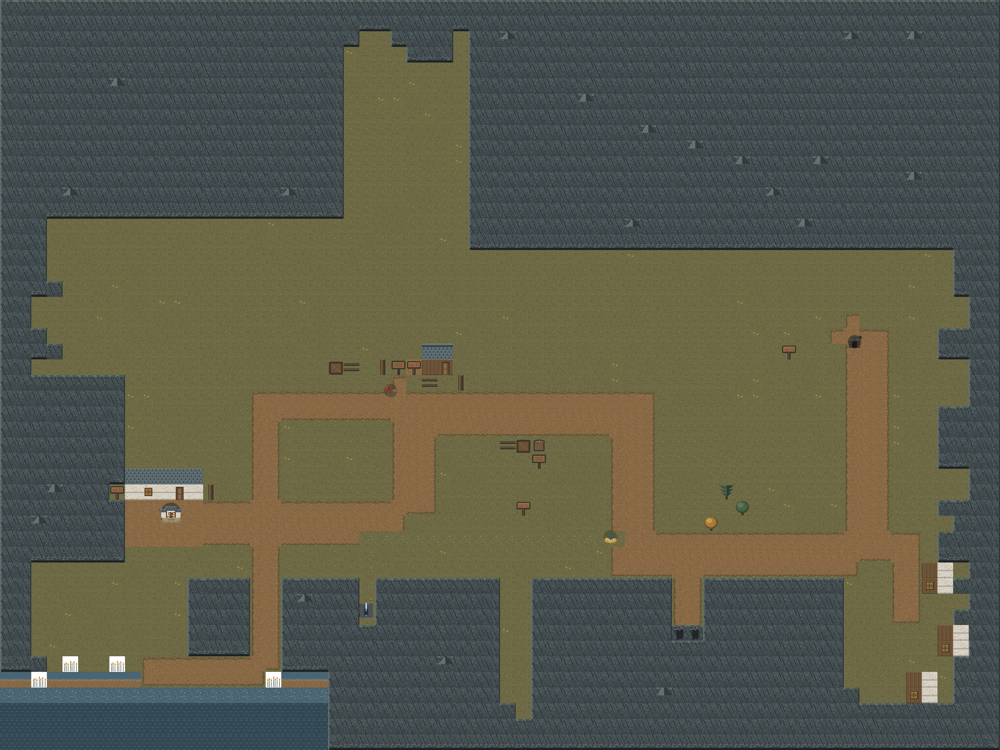

开局真实状态（迷雾只让 `reveal_on_map = 1` 的三处露出来）：

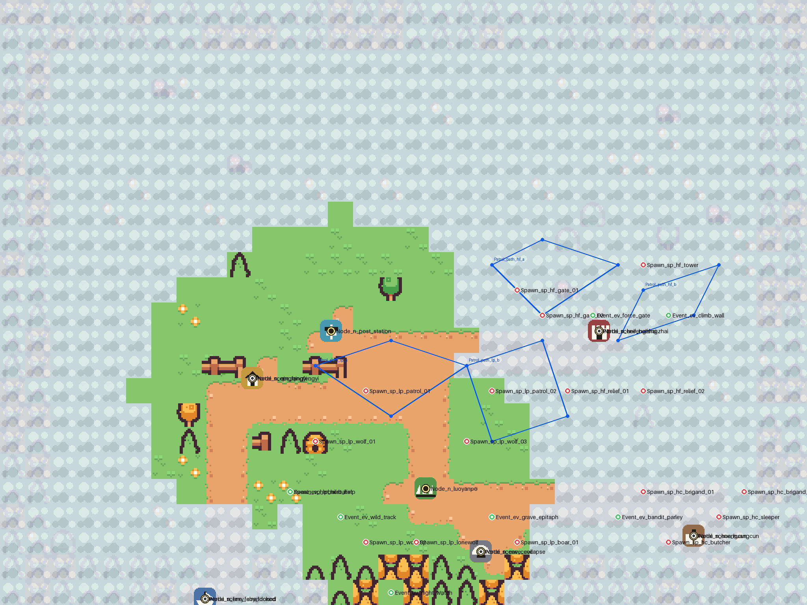

清风驿：

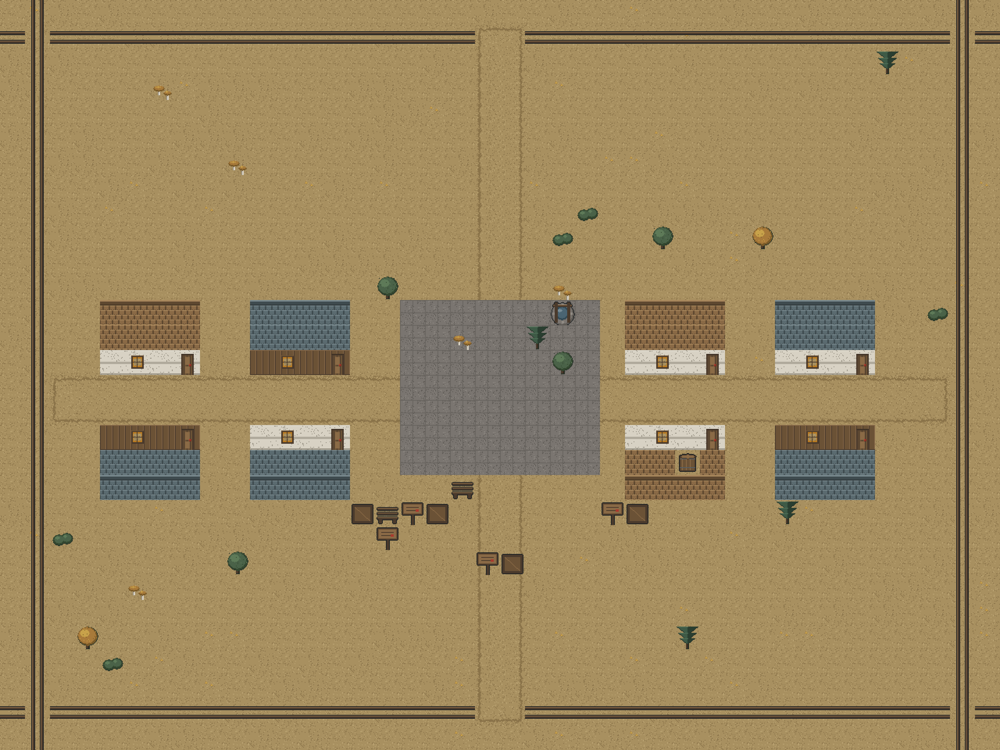

黑风寨三层（同一张场景图，纵向堆叠，这里按层裁开画）：

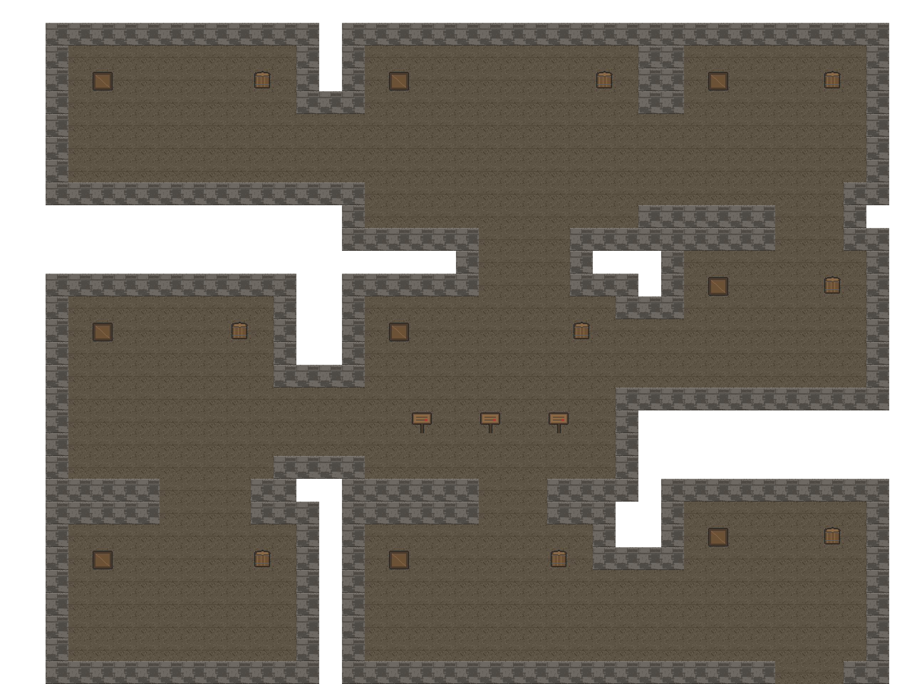

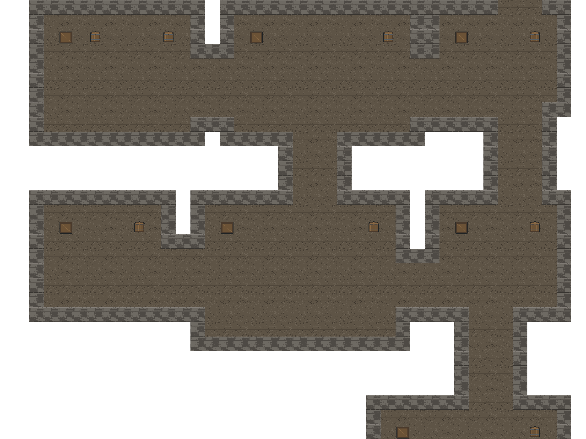

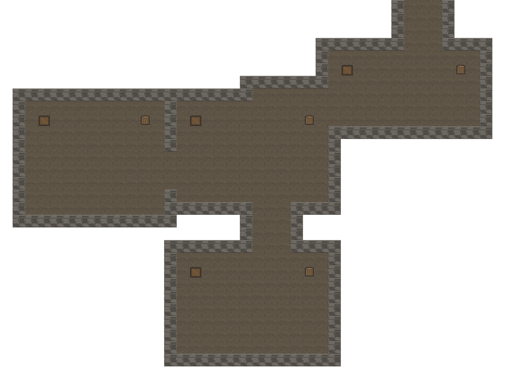

塌陷山洞 / 荒村 / 废弃渡口：

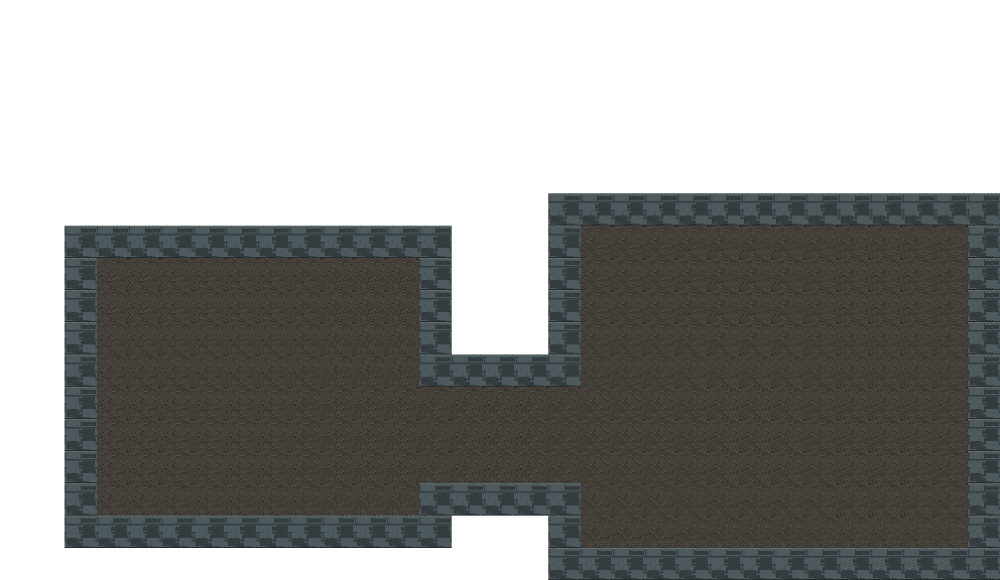

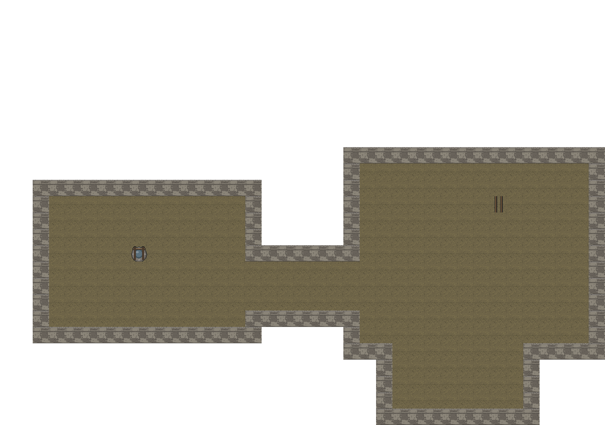

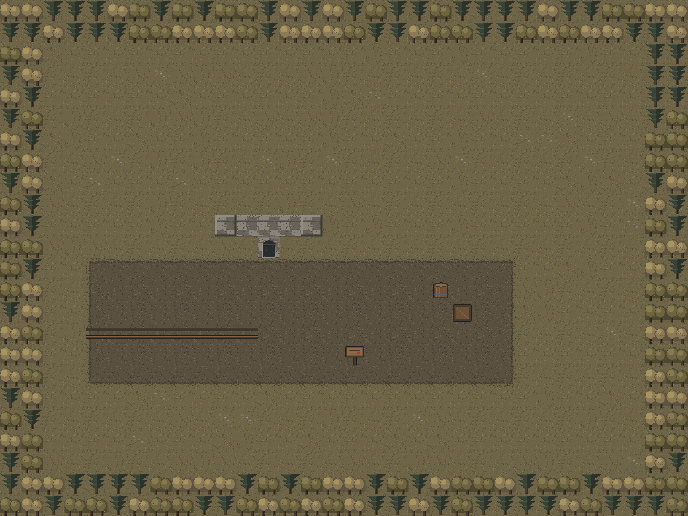

## 技术约定（照 07 文档第一节）

| 项目 | 落地情况 |
|---|---|
| 瓦片尺寸 | **32×32 px**，瓦片地图不缩放 |
| 玩家／明雷速度 | 由代码按「格」换算（`值 × 32 px`），地图侧只给格子 |
| 场景路径 | `scenes/maps/overworld.tscn` + `scenes/maps/scene_<scene_id>.tscn` |
| 图集 | `assets/tilesets/<主题>/<主题>_tileset.tres`（主题：jiangnan_wild / town / heifengzhai / cave / village） |
| 命名 | 全部 `snake_case`；挂钩点节点名 = 表里的 id + 文档规定的前缀 |
| 物理层 | 层 2 阻挡（瓦片碰撞层）、层 4 明雷警戒（Area2D + CircleShape2D）、层 5 房间边界（Area2D + RectangleShape2D） |

节点结构按文档：`Ground` / `Decor`（带碰撞，y_sort）/ `Overlay`（遮挡层，预留给运行时半透明）/ `Rooms` /
`Markers` / `Characters` / `Enemies` / `YSort` / `Camera`（`limit_*` 已对齐地图边界）；
大地图额外多一个 `Fog` 层（探索迷雾，逐格铺）。

**图层**（0.32.0 起）：大地图是 **5 层**——Ground／Decor／Overlay／**`Conditional`**／Fog
（第 5 层是 16 §3.2 新加的「条件地表」，只放石隙那条 22 格细径；`Overlay` 一直在、
玩家走到下面时半透明，`Conditional` 是程序按 `item_treasure_map` **整层显隐**）。
其余五张小地图 3 层。`verify_maps` 对两种图分别设上限：小地图 ≤4 层、大地图 ≤5 层；
瓦片上限也分档（小地图 5000／大地图 12000——64×48＝**3072 格/层**，光草底 ＋ 雾两层就 6000 出头，
原来那条 5000 是按 32×24 定的）。

**挡路的瓦片只许画在 `Decor` 层**：`verify_maps` 现在逐层查「除 `Decor` 外任何一层都不许有碰撞瓦片」
（`Ground`／`Overlay`／`Conditional`／`Fog` 全在内）。`Ground` 那条是 2026-10-04 玩家报的
「副本里走不动」留下的；0.32.0 加了 `Conditional` 与压在 `Overlay` 上的岩檐之后，同一条规矩跟着扩到这两层——
`Conditional` 还要「拿到藏宝图才出现」，把碰撞写上去等于**随藏宝图冒出一堵看不见的墙**。
另外交付时会打一行「`Conditional` 层 N 格」（大地图现在 22 格），改完顺手看一眼。

## Marker 绑约（照 07 文档第二节）

| 前缀 | 数量 | 落位 |
|---|---|---|
| `Node_` | 8 | 大地图，坐标直接用 `map_region.pos_x/pos_y`（像素，不吸附格子） |
| `Portal_` | 6 | 大地图，`Portal_<scene_id>` 放在对应地标上 |
| **`Sign_`** | **4** | 大地图主路 4 个节点附近各一块（0.31.2）——文案取 `map_region.signpost_cn`，牌子名 = `Sign_<node_id>`；`map_region` 里那列空着就不显示字 |
| `Spawn_` | 17 | 大地图，落在各自 `region_id` 的地标附近；`alert_radius > 0` 的带「警戒圈」Area2D |
| `Patrol_` | 4 | 大地图，`Patrol_path_lp_a/b`、`Patrol_path_hf_a/b`，Path2D |
| `Event_` | 13 | 8 处在大地图（含驿站外的官道关卡 `ev_patrol_check`）、1 处在清风驿（赌局）、4 处在黑风寨 |
| `Observe_` | 18 | 3 处在大地图（旧镖车那三处）、15 处在小地图（0.32.0 加了渡口封渡木桩那条）；名字 = `flavor_point.point_id` |
| `Trigger_` | 8 个位点 / 7 个 id | 黑风寨 7 处（`trig_wine` 占两处）＋塌陷山洞 `trig_dig` |
| `Chest_` | 5 | 黑风寨 4 处（铜／银／银／金）＋荒村 1 处 |
| `Room_` | 23 | 黑风寨 19＋塌陷山洞 2＋荒村 2，每个是 Node2D + Area2D（层 5） |
| `Team_` | 7 | `Enemies/<room_id>/Team_<team_id>`，唯一带父目录的约定；落点在房间入口内侧 |
| `Exit_` | 4 | 小地图回大地图的出口 `Exit_<scene_id>`，放在入口房间（渡口不开放，不做） |
| `Characters/player_spawn` | 5 | **每张小地图一个**，`Marker2D` + `metadata/role = "player"`；运行期就用它当进图落点（缺了才退回入口房间中心／出口位点）。注意：出生点**可以**压在 `Exit_` 上（清风驿就是），运行期的出口要「先走出去一次」才武装，不会一进城就被弹回大地图 |
| `Markers/Portal_<scene_id>` | 1 | 小地图内部的**跨图捷径**：塌陷山洞 `trig_dig` 挖通 → 直达黑风寨的后山地牢 `hf3_dungeon`（运行期读它来换图，别再靠「猜目标房间在哪张图」） |

同名 id 出现在同一场景内时（两个 `Chest_drop_chest_silver`、`trig_wine` 两处），
在 `Markers/<room_id>/` 下分文件夹放，保证 Godot 同级不重名、名字又与表一一对应。

`Team_` 的落点由 `MapKit.room_entrance_inside()` 算：先从房间四边的开口里找到门，
再往里退 2 格、横向错 1 格——**进门看得见，又不正对门口挡路**（07 文档第五节的要求）。

## 怎么改

```bat
rem 1. 重新生成（会覆盖 .tscn）
"%GODOT_BIN%" --headless --path . --log-file .logs\mapgen_overworld.log --script res://tools/mapgen/build_overworld.gd
"%GODOT_BIN%" --headless --path . --log-file .logs\mapgen_local.log    --script res://tools/mapgen/build_local_maps.gd
"%GODOT_BIN%" --headless --path . --log-file .logs\mapgen_hf.log       --script res://tools/mapgen/build_heifengzhai.gd

rem 2. 按 07 文档第九节验收
rem    改完地图**必须**跑一次；它也已接进 tools\run_all_checks.bat（总命令里的「map acceptance」那一步），
rem    所以日常只要跑那条总命令就不会漏。单跑用下面这条：
cmd /c tools\check_maps.bat

rem 3. 出预览图（Python + Pillow；第 5 个参数是要藏掉的图层，第 6 个是行列裁剪范围）
python tools\mapgen\render_preview.py .logs\overworld_preview.json .logs\overworld.png . Fog
python tools\mapgen\render_preview.py .logs\scene_heifengzhai_preview.json .logs\hf1.png . "" 0:30

rem 4. 美术：重新生成墨色江湖贴图（只依赖 Node，不需要 Python／Godot）
node tools\artgen\artgen.js                 rem 五套图集 + 迷雾 + 图标 + 宝箱／火盆／NPC
node tools\artgen\artgen.js --maps          rem 顺带重出 docs\dev\images 下的区域地图预览

rem 5. 旧路：占位资源的生成脚本（已退役，留着只为能回看当时怎么做的）
python tools\mapgen\scale_atlas.py          rem 16px 源图 → 32px 图集（Kenney 那套）
python tools\mapgen\make_placeholders.py    rem 迷雾、图标、宝箱、NPC 占位
```

`verify_maps.gd` **已通过**（`MAPCHECK: OK`）。它逐条实现文档第九节：

1. 命名与归属：Marker 名 ↔ 表 id 双向比对；`Room_` 在正确场景、`Spawn_` 在正确区域
2. 连通性：在地板上洪水填充，`exit_rooms` 声明的每一对都必须真的走得通、且没有进不去的房间
3. 可绕与背袭：每处明雷周围要留得出 2 格宽通路（3×3 邻域至少 5 格能站人）
4. 战斗房间侧向通路：房间边界开口至少 2 格宽
5. 巡逻：Path2D 端点不卡墙
6. 性能：TileMapLayer ≤ 4、瓦片 ≤ 5000、单区域明雷 ≤ 8
7. **Ground 层不许出现带物理碰撞的瓦片**（2026-10-04 补）：按这套模型的约定，
   **挡路的瓦片一律画在 Decor 层**，Ground 就是「走得上去的地面」。这条以前没人管，
   结果主题 TileSet 把地板瓦片（图集 1,9）也写成了实心格——副本／洞穴／城镇广场整片走不动
   （见 `框架说明.md` 决策 269）。主题的 `solid` 清单**只收墙**：`MapKit.TILES_STONE_SOLID`
   （`T_BATTLEMENT`／`T_WALL_TOP_CORNER`／`T_ARCH`），地板 `T_FLOOR`／`T_FLOOR_TOP` 不在里面；
   五个主题逐格核对由 `tests/test_map_assets.gd::_check_theme_tiles()` 盯着。

它抓到的真问题都改了：明雷贴着地图边界没有绕行空间、房间开口被算成 1 格宽、边界密林压住判定位点。

> **重跑生成脚本会覆盖场景。** 一旦在编辑器里手工修过图，就以场景为准，不要再重跑。

## 还缺的地图资产（**现在的口径**）

下面是「**代码已经等在那儿、只差地图上摆东西**」的清单。权威条目在 `docs/dev/待策划确认.md`
的 **A1–A6**（`当前状态.md` 3.3 是详细版）；这里只写**动手时需要的命名与位置约定**——
名字写错代码认不出来，而 `tools\check_maps.bat` 只会报「有位点接不上」，不会告诉你该叫什么。

| # | 缺什么 | 摆在哪 / **必须用什么名字** |
|---|---|---|
| **A6** | **木桩**（城镇练级场，09 §3.3） | 清风驿**校场**加一个建筑位点（16 §4.2 还要求**校场这块地本身**：独立地面〔夯土／沙地〕＋围栏＋兵器架，**两张图上都要一眼认得出**——只摆一根木桩不算做完），**必须叫 `bld_dummy`**，挂在 `Markers/Buildings/` 下（与四家店同级）：代码按 `building_def.building_id` 认它，按 E 进练习战。**敌人那两行数据 0.14.0 已经落了**（Q52 已关），所以摆上就能打。**还有一条压在它上面的**：引导链**第三步**的字面就是「**在校场木桩上练到 5 级**，把家伙和药备齐」（16 §「校场要显眼。木桩是前期唯一的练级点，玩家找不到它就不能开工」）——位点没摆之前那句话指着一件不存在的东西；判据（等级 ＋ 回血道具）不受影响，但**字面对不上**（见 `框架说明.md` 决策 344） |
| **A1** | **三火盆**（顺序谜题） | `scene_heifengzhai` 的 `hf1_brazier` 现在只有 1 个 `Trigger_trig_brazier`，要换成 **`Trigger_trig_brazier_1`／`_2`／`_3` 三个**（**代码按末尾编号认身份**），并让「灭／燃」两态显示出来（两张贴图已在 `assets/` 里） |
| ~~A2~~ | ~~雾的贴图／tileset~~ | **已交付**（`assets/tilesets/ink_jianghu/fog_tile.png`，五个主题的 fog 源都指向它） |
| ~~A3~~ | ~~精英 `marker_elite_red` 贴图~~ | **已交付并接线**（2026-10-04，决策 304）：`roaming_enemy._make_elite_glow()` 现在按 `roaming_spawn.elite_marker` 的 id 拼路径加载 `assets/sprites/icons/marker_elite_red.png`（32×32 套住 26×26 的占位块），**贴图缺失才退回程序化八边形**；用例逐字比 `texture.resource_path` ＋ 一条兜底断言。~~原写「程序化光晕先留着、要用贴图得改 `roaming_enemy.gd`」~~：那是接线前的状态，已过期（2026-10-04 决策 338 订正） |
| A4 | 宝箱位点与贴图对齐口径 | 以位点为准还是以贴图为准（现在按「以位点为准」接的） |
| A5 | `assets/tilesets/kenney_tiny_town/` 整套留不留 | 见 `待策划确认.md` A5（源图集与那份过期 tileset 要**分开**答） |
| ~~A13~~ | ~~**大地图主路与支路没有区分**~~ | **✅ 已交付（0.31.1 定名单，2026-10-04 落地）**：主路 1 条 3 格、支路 4 条 2 格、石隙细径 1 格且走碎石草地；名单与宽度都写进 `build_overworld.gd` 的 `ROADS`（每条边自己的宽度）与 `SHIXI_TRAIL`。美术的浅色支路瓦片仍是**待办**（现在两级靠**宽度**区分，颜色还没分） |

**摆完怎么验**：先跑 `tools\check_maps.bat`（`MAPCHECK: OK`，它逐条核命名与归属），
再跑 `tools\run_all_checks.bat`——木桩与三火盆那两条用例会从「等地编」那一段自动翻过来。

## 美术：墨色江湖第一版（2026-10-04）

15_美术风格需求与 16_区域美术设定定了「低饱和像素武侠」这条线，第一版照它出图：

| 内容 | 现状 |
|---|---|
| 瓦片图集 | **五套主题各一张**：`assets/tilesets/ink_jianghu/<主题>/tilemap_packed.png`（32×32 packed，384×352，12×11 格）。图集坐标与 `tools/mapgen/map_kit.gd` 的 `T_*` 常量一一对应，**换图不用动场景** |
| 主题差异 | 每张图集一套区域主色＋材质语言：草甸松林（大地图）／青瓦白墙灯火（清风驿）／粗原木毛石（黑风寨）／青灰岩壁（山洞）／焦黑夯土（荒村·渡口）。相邻区域不撞主色（16 §五） |
| 迷雾 | `assets/tilesets/ink_jianghu/fog_tile.png`——半透明云气**保留地形轮廓**，不再是「看起来像地形的雾」（16 §3.3、07 §11 第 5 条） |
| 大地图图标 | 7 个地标＋灰态（`<id>_dim`）＋高亮环；文件名与 `map_region.icon` 一一对应。剪影按 16 §3.5：城镇＝屋舍、副本＝寨门、驿站＝旗杆马桩 |
| 精英光晕 | `assets/sprites/icons/marker_elite_red.png`（07 §11 第 7 条点名要的那张；代码里程序化光晕那条路仍在，接不接由地编定） |
| 宝箱／火盆／NPC | 铜／银／金 × 开／关、火盆灭／燃、人形剪影（15 §4.6 要求「初期不能用纯空白」） |
| 水面 | 深水／浅水／水岸／芦苇＋脚印／血迹（`T_WATER_*`／`T_REEDS`／`T_FOOTPRINT`／`T_BLOOD`）：渡口那套「灰蓝水汽」材质终于有图可用 |
| **石隙迷窟**（第 6 套主题，2026-10-04 设计 0.27 新增） | `assets/tilesets/ink_jianghu/shixi/` ＋ `assets/tilesets/shixi/shixi_tileset.tres`。青灰岩＋暗赭缝土＋遗篇幽蓝；主墙体走**「笔直有裂缝」**的画法（`wallStyle = crack`），与塌陷山洞的砌块岩壁刻意相反。另有三格专用瓦片：一线天光 `T_SKY_SLIT`、前朝石台 `T_SHRINE_PLATFORM`、碎石堆 `T_RUBBLE`，以及**岩檐** `T_ROCK_EAVE`（死路画法的关键，见下） |
| **大地图图标按类型分尺寸** | 城镇 `icon_town.png` 是 **48×48**（16 §3.5：城镇最大最显眼），其余副本／驿站／兴趣点都是 32×32；第 8 个地标 `icon_shixi.png`（劈开的窄岩缝＋一线天光）已出，但**表里 `map_region.n_shixi.icon` 还填着 `icon_ruin`**，见下面的「回报设计侧」第 12 条 |
| **NPC 头像 8 张** | `assets/sprites/avatars/avatar_<npc_id>.png`，**原生 32×32、头肩构图**（15 §4.2 补；显示时 2× 到 64×64）。文件名 = `npc_def.npc_id`，由 `NpcPanel.avatar_path()` 直接拼——**注意不是设计文档里写的 `assets/sprites/npc/`**（见「回报设计侧」第 15 条）。0.29.0 的第 8 张是沈雁回（`npc_shen_yanhui`，**id 待表落实**：`npc_def` 现在只有 7 行） |
| **敌人剪影** | `assets/sprites/<faction>/<enemy_id>.png`（15 §六）。先出了两条做**对照**：`bandit/en_bd_thug.png`（山寨喽啰：深褐短打＋头巾打结＋**手里提着刀**＋外八站姿）与 `neutral/en_wanderer_disciple.png`（别派弟子：靛青制服＋束发飘带＋**背后斜背剑**＋并拢站姿）。15 §4.2 要求「种类区分靠剪影与配色」，这两条就是那条要求的样板。**2026-10-04 已接线**（决策 312）：战斗界面的敌人行按 `<faction>/<enemy_id>` 找图，有图就挂 32×32 剪影——**其余 13 个敌人出图即显示**，不用再改代码 |
| **物品图标（3 张）** | `assets/icons/item/item_treasure_map.png`（藏宝图）、`item_scroll_yipian.png`（遗篇残卷）、`item_bd_ledger.png`（账册，0.29.0）。路径按 15 §六 `icons/item/<item_id>.png`。**2026-10-04 已接线**（决策 309）：背包那一行有图就挂 32×32 图标（`item_base.icon` 为空则退回 `item_id`）——**其余 16 张出图即显示** |

角色侧那几张的总览（上排 8 个 NPC 头像，下排左起：山寨喽啰／别派弟子／藏宝图／遗篇残卷／账册）：


图标与道具总览（上排＝7 个地标＋高亮环＋精英光晕，第二排＝未解锁灰态，
第三／四排＝宝箱六态、火盆两态、NPC 剪影）：

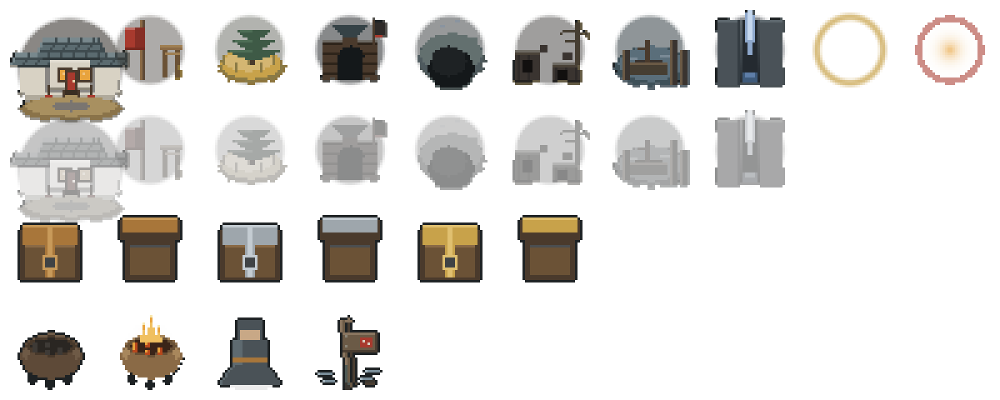

生成器是 `tools/artgen/`（只依赖 Node 内置 zlib，不需要 Python／Pillow／Godot）：

```bat
node tools\artgen\artgen.js            rem 五套图集 + 迷雾 + 图标 + 道具
node tools\artgen\artgen.js --maps     rem 顺带重出下面这些区域地图预览
```

**为什么是「生成」而不是「导入素材」**：像素画的每一笔都要可复现、可回改。生成器就是这批美术的
源文件——改一处颜色或一个瓦片，重跑一次，五套图集与所有图标一起跟上，不会出现「手改了一张 PNG、
下一批忘了改」的漂移。换真美术时仍然照 15 §六：**同名覆盖**，场景与代码一行不改。

**区域地图预览是真渲染出来的**，不是另画的概念图：`tools/artgen/render_maps.js` 直接读
`scenes/maps/*.tscn` 的 `tile_map_data`（4 字节头 + 每格 12 字节），按图层顺序铺图、再把 Marker 上的
图标叠上去。

### 大地图的山（0.31.2：给地编的坐标与铺法）

用户试玩反馈是「大地图太小、洞穴希望**融入到山体中**，而不是孤零零放个图标」。所以大地图多了一套
**山**，全部在 `jiangnan_wild` 那一张图集里（坐标与 `map_kit.gd` 的 `T_MTN_*`／`T_CAVE_RECESS`／
`T_CRACK_MOUTH`／`T_SIGNPOST` 一一对应）：

> **✅ 已落地（0.31.2，2026-10-04）**：`build_overworld.gd` 按这一节重建了大地图——
> 画布 2048×1536、8 个节点按新坐标、6 条路（主路 3 格／支路 2 格）、**边缘改成山／水的自然边界**、
> 成片的山体 ＋ 嵌在里面的两个洞口、`Sign_<node_id>` 指路牌 4 块、明雷 17 位点与巡逻 4 条重摆，
> 随 0.32.0 又加了 `Conditional` 细径层与「开局只亮清风驿与驿站」。
> **随机撒树删掉了**（用户原话「不需要那么多阻挡」）：整片图只有刻意摆的装饰——落雁坡那几株
> 定位孤树、驿站／城镇的屋舍、关卡的拒马、镖车、路牌；`scatter_trees` 在大地图上不再调用。
> 铺法落在 `map_kit.paint_mountains()`（九宫格 ＋ 山峰，见下）。

| 用途 | 坐标 | 挡路 |
|---|---|---|
| 山体**九宫格**（与土路那套同一种用法） | 左上 `(2,4)`／上脊 `(3,4)`／右上 `(4,4)`／左缘 `(2,5)`／**岩面** `(3,5)`／右缘 `(4,5)`／坡脚左下 `(2,6)`／坡脚 `(3,6)`／坡脚右下 `(4,6)` | **是** |
| **岩面第二变体** `C2 (8,4)` | 一片山会铺几百格，`C`／`C2` **交替**就不露"瓦片格子" | **是** |
| **山峰** 两档：低 `(0,4)`／高 `(0,5)` | 插在山体内部打断"一整片墙"，一屏（16×9 格）里放 1–3 座就够 | **是** |
| **塌陷山洞的洞口** `(0,6)` | **山体上的一个凹陷**（洞口上檐是塌下来的碎石、脚下有落石） | **否**（要走得进去） |
| **石隙迷窟的入口** `(7,4)` | **山体上的一道笔直窄缝**，缝顶一线天光——与塌陷山洞刻意相反（塌出来的 vs 劈出来的） | **否** |
| **路牌** `(7,6)` | 木牌＋朱红箭头＋几笔字痕；**地名由 Label 叠上去**（32×32 写不下真汉字，那是字体线的活） | **是** |

铺法三条（不然会露馅）：

1. **`mask` 决定用哪一格**：一格的四邻里有几边不属于山体，就用对应那一格——`paint_dirt()` 那套逻辑
   直接照搬即可（上脊 `T` 只在最上一排、坡脚 `B` 只在最下一排）。
2. **山体必须成片**：一层山至少铺 2–3 屏（相机 2×，一屏约 16×9 格）。**孤立一格山 = 又变回"摆在地上的图标"**。
3. **洞口要嵌在山体里**：四周都是山体、洞口那一格是开口——玩家看到的是"山塌了一块，后面是洞"，
   而不是"地上放了个洞"。

### 石隙迷窟（第 8 个区域）：两处死路怎么画（**已定：方案 ① 岩檐遮挡**）

16 §4.8 的要求是「两条死路必须在视觉上**看起来能走**——画明显了，迷宫就不成立了」。
动笔画之前要先说清一件俯视 2D 绕不过去的事：

> **玩家能把整条岔缝一眼看完。** 视口 1152×648 ÷ 32px ≈ 36×20 格，
> 而小迷宫一间房才几格宽——**两格深的死路，在俯视视角下一定是明摆着的**，
> 瓦片再怎么画都救不回来。要么**内段被遮住**，要么**岔缝长到一屏看不完**。

所以美术侧给的是三种做法，不是三套瓦片（图：`images/石隙死路画法_示意.png`，
用 `node tools\artgen\deadend_mock.js` 可重出，面板宽度就是一屏的 36 格）：

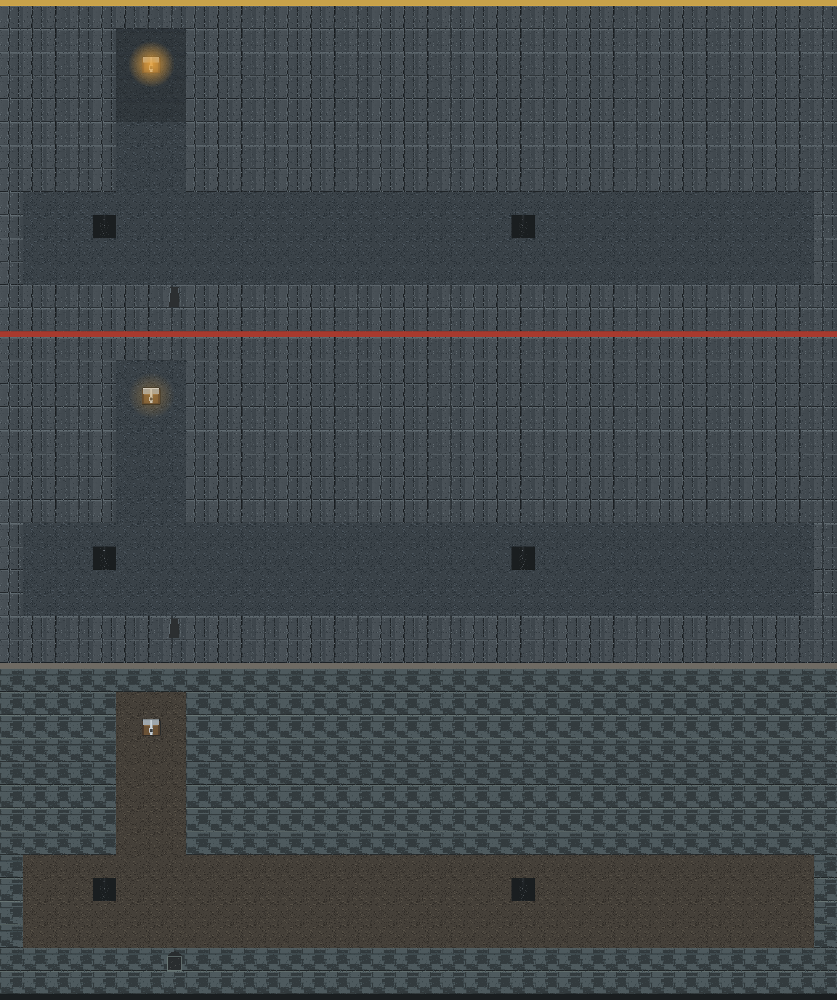

> **✅ 已定（0.32.0，小策划拍板）：选方案 ①「岩檐遮挡」。**
> 不选方案 ②（把岔缝拉到 ≥30 格）——那段路枯燥，还得把石隙画布从 36×26 格撑大。
> **地编实测前提不成立**：石隙画布 36×26 格＝1152×832 px，而基准视口 1152×648 px＝36×20.25 格，
> **图宽正好一屏**——站在岔口就能把两格深的岔缝看到尾，所以必须遮。
> 落地：`scene_shixi` 的 `_paint_shixi_details()` 把两条死路的**内段**（`mz_03` 的 x13–18、
> `mz_05` 的 x29–35）压 `T_ROCK_EAVE` 到 **`Overlay`** 层；**岔口那一格留亮**——
> 要让人看得见「这里有路可走」，盖住整条就变成一堵墙、迷宫反而露馅。
> 程序侧要做的：玩家走到 `Overlay` 下方时把它半透明化（07 §节点结构原文那句）。

| 方案 | 怎么做 | 代价 |
|---|---|---|
| ① **岩檐遮挡**（推荐，图上枯黄分隔带） | 岔缝内段压一片 `T_ROCK_EAVE` 到 `Overlay` 层：玩家在缝口**只看到黑**，走进去（Overlay 半透明）才看见尽头。图上那份还让宝箱的光从檐边漏一点出来——「里面有东西」的诱饵 | **要开发侧把 `Overlay` 的半透明接上**：07 §节点结构写的是「玩家走到下面时半透明」，但工程侧现在只是「预留给运行时」（`地图搭建说明.md` 上面那句），得排一条代码 |
| ② **岔缝拉长**（图上朱红是反例） | 不遮挡，把死路岔缝拉到 **≥1.5 屏（约 30 格）**、中途拐一次弯，尽头自然在视野外 | 纯关卡成本：两处死路各多铺 20+ 格走廊，而且**走这段路本身很枯燥** |
| ③ 接受被看穿 | 不做「看起来能走」，死路就是明摆着的死路 | 迷宫退化成「多走两步的走廊」（16 §4.8 明确不要这个） |

两条**不管选哪个都要守**的规矩：

1. **不提供任何「死路专用」瓦片。** 不画坍塌堵死、不画断头——一旦有这种瓦片，地编一定会用，
   而用了就等于提前告诉玩家。整套 `shixi` 图集里最接近「开口」的只有 `T_ARCH`（岩缝开口），
   而它**真岔路与死路共用同一张**。
2. **岔缝宽度、开口形态在真路与死路上完全一致。** 「越走越窄」「口越来越小」这类变化如果只出现在
   死路上，玩家两次就学会了，之后所有岔路都能靠宽度猜——线索一旦规律化，迷宫就没了。

（塌方那间还叠了一条设计已经写好的诱饵：**宝箱的光比别处亮**——走错一趟至少拿到箱子，
不是纯粹的浪费。空室那间建议把 `T_SKY_SLIT` 的一线天光打在房间中央，
让玩家「以为里面有东西」。）

## 回报设计侧：配置表与文档对不上的地方

1. ~~**`dungeon_room.exit_rooms` 只写了单向**~~ **已解决（2026-10-04，决策 326）**：开发侧把表
   逐行补成对称（例：`hf1_gate → hf1_yard` 与 `hf1_yard → hf1_gate` 双向都有；机器复核
   **单向 0 条**），并加了断言 `tests/test_dungeon.gd::_check_exit_symmetry` 兜住回归。
   地图侧这边不用动。
2. **层与层之间没有声明连通**：一层到二层在 `exit_rooms` 里找不到任何连接。
   文档 4.2 说"层与层之间用 `Portal_` 楼梯连接"，但 `Portal_` 绑的是 `scene_id`，装不下层间楼梯。
   我补了一条走廊并加了标记 `stairs_to_floor2`，**命名需要设计侧定**。
3. ~~小地图回大地图的出口没有命名~~ → 已按文档 4.0 落地 `Exit_<scene_id>`（4 个，渡口不做）。
4. ~~固定敌人没有 Marker 命名约定~~ → 已按文档第二节落地 `Enemies/<room_id>/Team_<team_id>`（7 个）。
   顺带修了 `tests/test_map_assets.gd` 的一个 bug：它的 `MARKER_PREFIXES` 白名单里没有
   `Team_` / `Exit_`，`_collect` 根本不收这两类节点，所以位点摆好了那条"待补"也永远不消失；
   把两个前缀加进白名单、并把 `PENDING_*` 开关关掉后，这两条已经是硬失败（当前自检 1949 条全绿）。
5. **建筑也没有前缀约定**：清风驿的店铺我按第一节"节点名用 id 原名"直接叫 `bld_smith` 等，
   放在 `Markers/Buildings/` 下；表里没有 id 的三处（当铺／客栈／悬赏板）挂 `facility_` 前缀。
6. **城镇的"1 个房间"没有 room_id**：`map_local` 写清风驿 1 个房间，但 `dungeon_room.csv` 里没有它的行，
   所以这张图没有 `Room_` 标记。
7. **`scene_<scene_id>.tscn` 会拼出双前缀**：`scene_id` 本身已经是 `scene_qingfengyi`，
   按字面写会得到 `scene_scene_qingfengyi.tscn`。我按**文件名 = scene_id** 落地（`scene_qingfengyi.tscn`）。
8. **`ev_bandit_parley` 位点自相矛盾**：第五节的房间表写在 `hc_01`，第六节的位点表写"大地图·荒村"。
   我按第六节放在大地图。另外 `event_check.csv` 里它和 `ev_grave_epitaph` 都只有 `region_id`
   （`n_huangcun` / `n_cave_collapse`），按 region 推会推到小地图里去，建议表里补 `scene_id` 或加个"大地图"标记。
9. **`map_local.room_count` 黑风寨 18 vs 房间表 19**：文档自己也标了，以房间表（19）为准。
10. ~~**水面瓦片仍然缺**~~ → **已交付**（`T_WATER_DEEP`／`T_WATER_SHALLOW`／`T_WATER_SHORE`／`T_REEDS`，
    见 15 §4.1 的「特殊」一类）。深水挡路、浅水与水岸可走，芦苇荡能钻进去——怎么摆由地编定，
    但**素材这条路已经通了**：渡口不必再拿栅栏＋木箱顶替。
11. ~~**瓦片尺寸的说法不一致**~~ → **已结案（2026-10-04）**：设计侧核对了工程
    （`map_kit.TILE_PX = 32`、五套图集 384×352＝12×11 格 ×32px、07 §一也是 32），
    判定 15 号那几处「16 × 16」是**笔误**，已把 15 号与 `交接单_美术.md` 一起改成 32×32。
    **第一版地形与图集不需要返工**；`4.4 九宫格` 里还有一个 16×16，那是**切图中心的尺寸**，不是瓦片。
12. ~~**`map_region.n_shixi.icon` 借的是荒村的图**~~ **已解决（0.32.0）**：设计侧把表里那一格
    改成 `icon_shixi`，同时**把四个兴趣点的 `icon` 全部清空**（16 §3.5「兴趣点不给图标」，
    石隙是唯一例外）——大地图上现在只有 5 个图标：清风驿／驿站／落雁坡／黑风寨／石隙。
    地图侧按「`icon` 为空就不挂图」出图，**没写死哪几个该有**。
13. ~~**石隙两处死路怎么画**~~ **已解决（0.32.0）**：选了方案 ①「岩檐遮挡」，
    见上面「石隙迷窟（第 8 个区域）」一节——两条死路的内段已经压上 `T_ROCK_EAVE`（`Overlay` 层）。
14. **UI 面板底板的边框装饰取向**：配色与九宫格规格已定，装饰未定；美术侧推荐**素边＋四角竹节**
    （四角只有 8×8，卷轴塞不进去；正文只有 12px 一档，边框一花就跟字抢）。等设计选
    （`待策划确认.md` A10）——**UI 那一批排在它后面**。
15. **NPC 头像的路径，文档与工程不一致**：15 §4.2 补写的是 `assets/sprites/npc/`，
    而 `src/ui/npc_panel.gd` 读的是 **`assets/sprites/avatars/avatar_<npc_id>.png`**
    （开发侧已经按这个路径建好了 7 张占位图，自检也按它判定）。**出图按工程那条走**——
    这类「设计写的是将来的路径、工程已经先定了另一条」的情况，一律以能加载到的那条为准。
16. ~~**沈雁回的表行还没进 `npc_def`**~~ **2026-10-04 已落表**：id 就是 `npc_shen_yanhui`
    （美术那张 `avatar_npc_shen_yanhui.png` 一字不差地对上了，界面直接能显示）。
    她现在也是**终局难题的说话人**（打赢大寨主 → 账册到手 → 回图那段三选一，见框架说明决策 305）。
    这条留档是因为它示范了那条纪律：**文件名与 id 必须一字不差**，否则界面找不到图。
17. **（开发侧回给地编）NPC 站位可以按 id 改名了**：07 §九 第 12 条原话是「先用 `npc_slot_0N` 占位，
    等 NPC／对话表（`dialogue_node`／`dialogue_option`）出来后**按 id 绑定**」——这两张表 **0.31.0 已落表**，
    所以前置条件满足。现在**两种命名都认**（`Characters/npc_slot_0N` 或 `Characters/npc_<npc_id>`），
    地编把位点改名成后者之后：谁站哪儿**写在图里**，不再靠 `npc_def` 的行序（行序一变，占位命名会
    **静默把旁边的人认成他**）。地图验收也升级了：按 id 绑的位点会核「这个人真的在 `npc_def` 里、
    而且就在这张图上」（写错 id 或摆错地图都会 FAIL）。判定只有一处（`NpcService.npc_for_slot`）——
    见 `框架说明.md` 决策 332。**改不改由地编定**，不改也照旧能跑。
