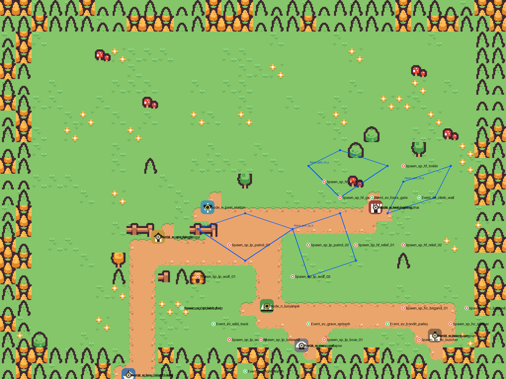
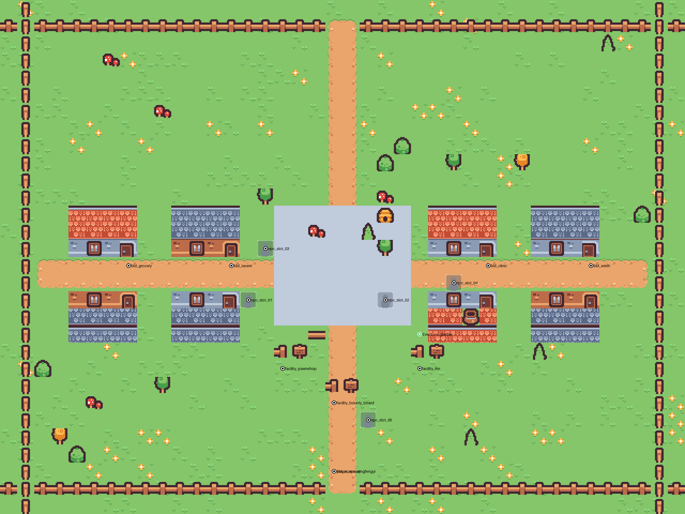
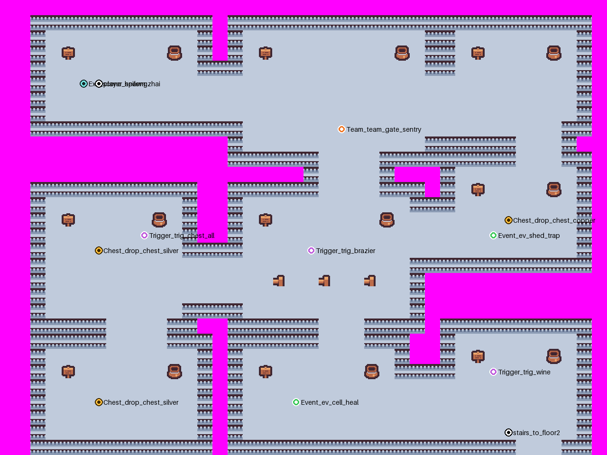
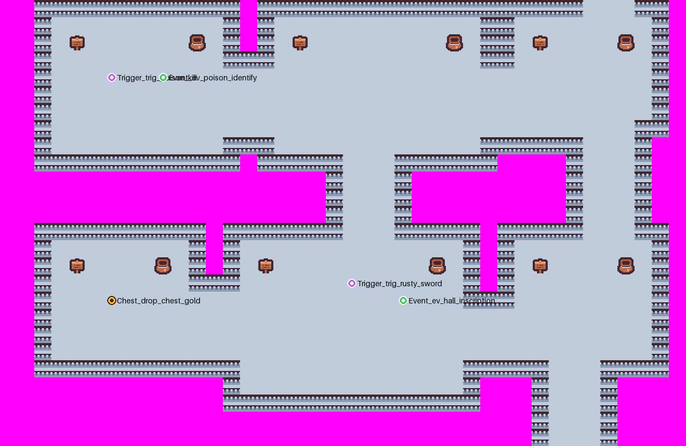
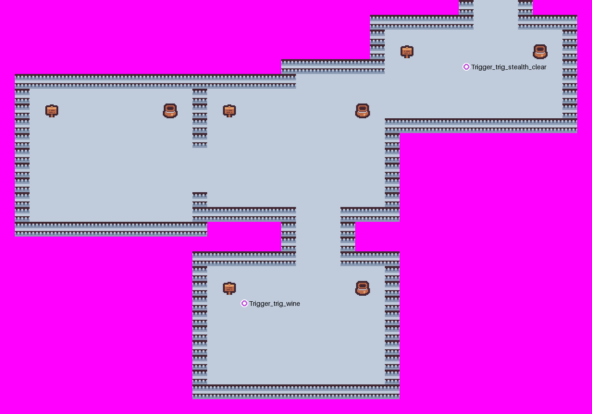
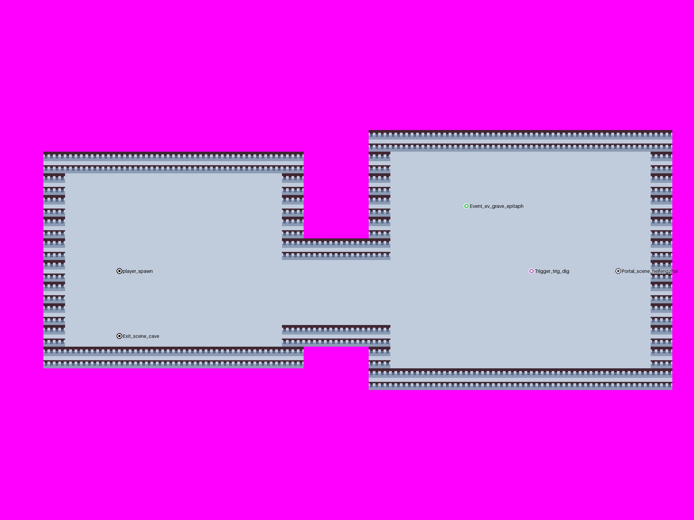
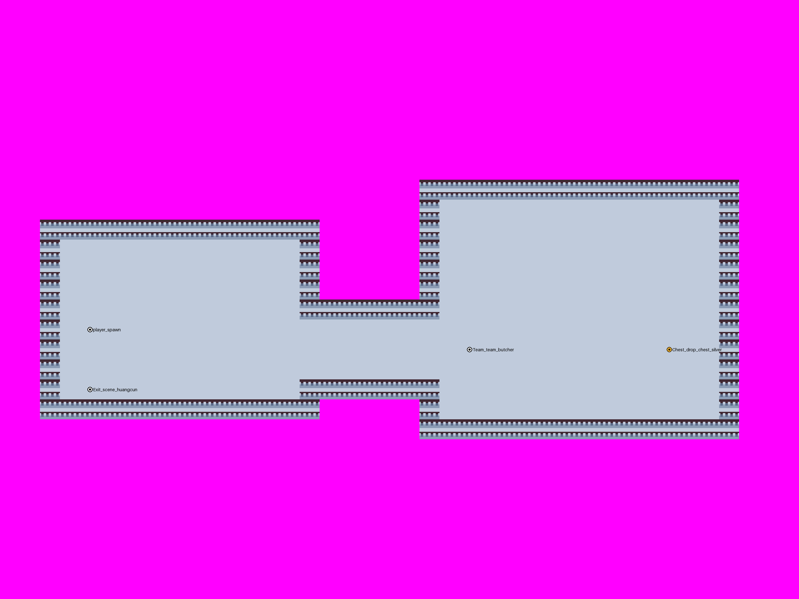
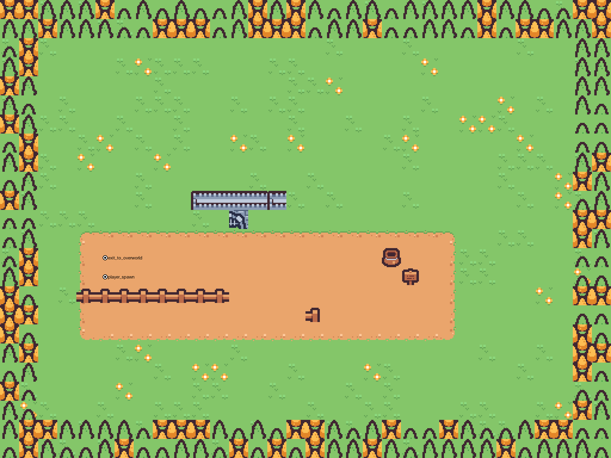

# 地图资源说明（按 07_地图资源需求.md）

## 交付了什么

六张地图 + 五套主题 TileSet + 占位美术 + 一个按文档第九节验收标准写的自检脚本。

| 场景 | 路径 | 画布 | 内容 |
|---|---|---|---|
| 大地图 | `scenes/maps/overworld.tscn` | 1024×768 px（32×24 格） | Node_×7、Portal_×5、Spawn_×17、Patrol_×4、Event_×7、迷雾层 |
| 清风驿 | `scenes/maps/scene_qingfengyi.tscn` | 1280×960 px（40×30 格） | 4 间表内店铺 + 4 间街景民居 + 当铺／客栈／悬赏板 + 5 个 NPC 位 + `Event_ev_gamble` |
| 黑风寨 | `scenes/maps/scene_heifengzhai.tscn` | 1280×2688 px（40×84 格，三层纵向堆叠） | Room_×19、Chest_×4、Trigger_×7、Event_×4 |
| 塌陷山洞 | `scenes/maps/scene_cave.tscn` | 1024×768 px（32×24 格） | Room_×2、`Trigger_trig_dig`、`Event_ev_grave_epitaph`、通往黑风寨的 `Portal_scene_heifengzhai` |
| 荒村 | `scenes/maps/scene_huangcun.tscn` | 1280×960 px（40×30 格） | Room_×2（hc_01／hc_02）、`Chest_drop_chest_silver` |
| 废弃渡口 | `scenes/maps/scene_ferry_locked.tscn` | 1024×768 px（32×24 格） | 1 区域，本章不开放：牌坊＋破船＋断桥封锁 |



开局真实状态（迷雾只让 `reveal_on_map = 1` 的三处露出来）：


清风驿：



黑风寨三层（同一张场景图，纵向堆叠，这里按层裁开画）：







塌陷山洞 / 荒村 / 废弃渡口：







## 技术约定（照 07 文档第一节）

| 项目 | 落地情况 |
|---|---|
| 瓦片尺寸 | **32×32 px**，瓦片地图不缩放 |
| 玩家／明雷速度 | 由代码按「格」换算（`值 × 32 px`），地图侧只给格子 |
| 场景路径 | `scenes/maps/overworld.tscn` + `scenes/maps/scene_<scene_id>.tscn` |
| 图集 | `assets/tilesets/<主题>/<主题>_tileset.tres`（主题：jiangnan_wild / town / heifengzhai / cave / village） |
| 命名 | 全部 `snake_case`；挂钩点节点名 = 表里的 id + 文档规定的前缀 |
| 物理层 | 层 2 阻挡（瓦片碰撞层）、层 4 明雷警戒（Area2D + CircleShape2D）、层 5 房间边界（Area2D + RectangleShape2D） |

节点结构按文档：`Ground` / `Decor`（带碰撞，y_sort）/ `Overlay`（遮挡层，预留给运行时半透明）/ `Rooms` /
`Markers` / `Characters` / `Enemies` / `YSort` / `Camera`（`limit_*` 已对齐地图边界）；
大地图额外多一个 `Fog` 层（探索迷雾，逐格铺）。

**单个场景最多 4 个 TileMapLayer**（文档验收 6）：大地图刚好 4 层（Ground／Decor／Overlay／Fog），
其余五张 3 层。瓦片用量最大的是黑风寨 2310 格，离 5000 的上限还有余量。

## Marker 绑约（照 07 文档第二节）

| 前缀 | 数量 | 落位 |
|---|---|---|
| `Node_` | 7 | 大地图，坐标直接用 `map_region.pos_x/pos_y`（像素，不吸附格子） |
| `Portal_` | 5 | 大地图，`Portal_<scene_id>` 放在对应地标上 |
| `Spawn_` | 17 | 大地图，落在各自 `region_id` 的地标附近；`alert_radius > 0` 的带「警戒圈」Area2D |
| `Patrol_` | 4 | 大地图，`Patrol_path_lp_a/b`、`Patrol_path_hf_a/b`，Path2D |
| `Event_` | 12 | 7 处在大地图、1 处在清风驿（赌局）、4 处在黑风寨 |
| `Trigger_` | 8 个位点 / 7 个 id | 黑风寨 7 处（`trig_wine` 占两处）＋塌陷山洞 `trig_dig` |
| `Chest_` | 5 | 黑风寨 4 处（铜／银／银／金）＋荒村 1 处 |
| `Room_` | 23 | 黑风寨 19＋塌陷山洞 2＋荒村 2，每个是 Node2D + Area2D（层 5） |
| `Team_` | 7 | `Enemies/<room_id>/Team_<team_id>`，唯一带父目录的约定；落点在房间入口内侧 |
| `Exit_` | 4 | 小地图回大地图的出口 `Exit_<scene_id>`，放在入口房间（渡口不开放，不做） |
| `Characters/player_spawn` | 5 | **每张小地图一个**，`Marker2D` + `metadata/role = "player"`；运行期就用它当进图落点（缺了才退回入口房间中心／出口位点）。注意：出生点**可以**压在 `Exit_` 上（清风驿就是），运行期的出口要「先走出去一次」才武装，不会一进城就被弹回大地图 |
| `Markers/Portal_<scene_id>` | 1 | 小地图内部的**跨图捷径**：塌陷山洞 `trig_dig` 挖通 → 直达黑风寨的后山地牢 `hf3_dungeon`（运行期读它来换图，别再靠「猜目标房间在哪张图」） |

同名 id 出现在同一场景内时（两个 `Chest_drop_chest_silver`、`trig_wine` 两处），
在 `Markers/<room_id>/` 下分文件夹放，保证 Godot 同级不重名、名字又与表一一对应。

`Team_` 的落点由 `MapKit.room_entrance_inside()` 算：先从房间四边的开口里找到门，
再往里退 2 格、横向错 1 格——**进门看得见，又不正对门口挡路**（07 文档第五节的要求）。

## 怎么改

```bat
rem 1. 重新生成（会覆盖 .tscn）
"%GODOT_BIN%" --headless --path . --log-file .logs\mapgen_overworld.log --script res://tools/mapgen/build_overworld.gd
"%GODOT_BIN%" --headless --path . --log-file .logs\mapgen_local.log    --script res://tools/mapgen/build_local_maps.gd
"%GODOT_BIN%" --headless --path . --log-file .logs\mapgen_hf.log       --script res://tools/mapgen/build_heifengzhai.gd

rem 2. 按 07 文档第九节验收
rem    改完地图**必须**跑一次；它也已接进 tools\run_all_checks.bat（总命令里的「map acceptance」那一步），
rem    所以日常只要跑那条总命令就不会漏。单跑用下面这条：
cmd /c tools\check_maps.bat

rem 3. 出预览图（Python + Pillow；第 5 个参数是要藏掉的图层，第 6 个是行列裁剪范围）
python tools\mapgen\render_preview.py .logs\overworld_preview.json .logs\overworld.png . Fog
python tools\mapgen\render_preview.py .logs\scene_heifengzhai_preview.json .logs\hf1.png . "" 0:30

rem 4. 美术：换图集 / 重做占位
python tools\mapgen\scale_atlas.py          rem 16px 源图 → 32px 图集
python tools\mapgen\make_placeholders.py    rem 迷雾、图标、宝箱、NPC 占位
```

`verify_maps.gd` **已通过**（`MAPCHECK: OK`）。它逐条实现文档第九节：

1. 命名与归属：Marker 名 ↔ 表 id 双向比对；`Room_` 在正确场景、`Spawn_` 在正确区域
2. 连通性：在地板上洪水填充，`exit_rooms` 声明的每一对都必须真的走得通、且没有进不去的房间
3. 可绕与背袭：每处明雷周围要留得出 2 格宽通路（3×3 邻域至少 5 格能站人）
4. 战斗房间侧向通路：房间边界开口至少 2 格宽
5. 巡逻：Path2D 端点不卡墙
6. 性能：TileMapLayer ≤ 4、瓦片 ≤ 5000、单区域明雷 ≤ 8
7. **Ground 层不许出现带物理碰撞的瓦片**（2026-10-04 补）：按这套模型的约定，
   **挡路的瓦片一律画在 Decor 层**，Ground 就是「走得上去的地面」。这条以前没人管，
   结果主题 TileSet 把地板瓦片（图集 1,9）也写成了实心格——副本／洞穴／城镇广场整片走不动
   （见 `框架说明.md` 决策 269）。主题的 `solid` 清单**只收墙**：`MapKit.TILES_STONE_SOLID`
   （`T_BATTLEMENT`／`T_WALL_TOP_CORNER`／`T_ARCH`），地板 `T_FLOOR`／`T_FLOOR_TOP` 不在里面；
   五个主题逐格核对由 `tests/test_map_assets.gd::_check_theme_tiles()` 盯着。

它抓到的真问题都改了：明雷贴着地图边界没有绕行空间、房间开口被算成 1 格宽、边界密林压住判定位点。

> **重跑生成脚本会覆盖场景。** 一旦在编辑器里手工修过图，就以场景为准，不要再重跑。

## 还缺的地图资产（**现在的口径**）

下面是「**代码已经等在那儿、只差地图上摆东西**」的清单。权威条目在 `docs/dev/待策划确认.md`
的 **A1–A6**（`当前状态.md` 3.3 是详细版）；这里只写**动手时需要的命名与位置约定**——
名字写错代码认不出来，而 `tools\check_maps.bat` 只会报「有位点接不上」，不会告诉你该叫什么。

| # | 缺什么 | 摆在哪 / **必须用什么名字** |
|---|---|---|
| **A6** | **木桩**（城镇练级场，09 §3.3） | 清风驿**校场**加一个建筑位点，**必须叫 `bld_dummy`**，挂在 `Markers/Buildings/` 下（与四家店同级）：代码按 `building_def.building_id` 认它，按 E 进练习战。**还要设计侧补木桩的两行敌人数据**（Q52），两样都到位才会真开打 |
| **A1** | **三火盆**（顺序谜题） | `scene_heifengzhai` 的 `hf1_brazier` 现在只有 1 个 `Trigger_trig_brazier`，要换成 **`Trigger_trig_brazier_1`／`_2`／`_3` 三个**（**代码按末尾编号认身份**），并让「灭／燃」两态显示出来（两张贴图已在 `assets/` 里） |
| A2 | 雾的贴图／tileset | 现在复用江南野地资源，看起来像地形不像云雾 |
| A3 | 精英 `marker_elite_red` 贴图 | 现在用程序化金色光晕顶着 |
| A4 | 宝箱位点与贴图对齐口径 | 以位点为准还是以贴图为准（现在按「以位点为准」接的） |
| A5 | `assets/tilesets/kenney_tiny_town/` 整套留不留 | 见 `待策划确认.md` A5（源图集与那份过期 tileset 要**分开**答） |

**摆完怎么验**：先跑 `tools\check_maps.bat`（`MAPCHECK: OK`，它逐条核命名与归属），
再跑 `tools\run_all_checks.bat`——木桩与三火盆那两条用例会从「等地编」那一段自动翻过来。

## 美术现状：全是占位

正式美术还没到，现在顶上的是「一眼能看出是占位」的东西：

| 内容 | 现状 |
|---|---|
| 瓦片图集 | Kenney Tiny Town（CC0，16×16）**最近邻放大 2 倍**凑 32px 规格，见 `assets/tilesets/_common/tiny_town_32.png` |
| 五套主题 TileSet | 共用上面那张图集，主题之间差在「收哪些瓦片、哪些挡路」 |
| 大地图图标 | 脚本画的 7 个图标＋灰态＋高亮环，文件名与 `map_region.icon` 一一对应 |
| 宝箱 | 铜／银／金 × 开／关，6 张 |
| 火盆／迷雾／NPC／通用可交互物 | 脚本画的占位（`tools/mapgen/make_placeholders.py`） |

换真美术时**不用动场景**：图集同名替换即可；图标／宝箱保持文件名，运行时按 id 取。

## 回报设计侧：配置表与文档对不上的地方

1. **`dungeon_room.exit_rooms` 只写了单向**（18 处，例：`hf1_gate → hf1_yard`，
   但 `hf1_yard` 的出口里没有 `hf1_gate`）。文档第九节要求"对向房间的出口里也要有回来"，
   地图上走廊已经做成双向可走，但表本身要补对称，否则以后按表生成会漏路。
2. **层与层之间没有声明连通**：一层到二层在 `exit_rooms` 里找不到任何连接。
   文档 4.2 说"层与层之间用 `Portal_` 楼梯连接"，但 `Portal_` 绑的是 `scene_id`，装不下层间楼梯。
   我补了一条走廊并加了标记 `stairs_to_floor2`，**命名需要设计侧定**。
3. ~~小地图回大地图的出口没有命名~~ → 已按文档 4.0 落地 `Exit_<scene_id>`（4 个，渡口不做）。
4. ~~固定敌人没有 Marker 命名约定~~ → 已按文档第二节落地 `Enemies/<room_id>/Team_<team_id>`（7 个）。
   顺带修了 `tests/test_map_assets.gd` 的一个 bug：它的 `MARKER_PREFIXES` 白名单里没有
   `Team_` / `Exit_`，`_collect` 根本不收这两类节点，所以位点摆好了那条"待补"也永远不消失；
   把两个前缀加进白名单、并把 `PENDING_*` 开关关掉后，这两条已经是硬失败（当前自检 1949 条全绿）。
5. **建筑也没有前缀约定**：清风驿的店铺我按第一节"节点名用 id 原名"直接叫 `bld_smith` 等，
   放在 `Markers/Buildings/` 下；表里没有 id 的三处（当铺／客栈／悬赏板）挂 `facility_` 前缀。
6. **城镇的"1 个房间"没有 room_id**：`map_local` 写清风驿 1 个房间，但 `dungeon_room.csv` 里没有它的行，
   所以这张图没有 `Room_` 标记。
7. **`scene_<scene_id>.tscn` 会拼出双前缀**：`scene_id` 本身已经是 `scene_qingfengyi`，
   按字面写会得到 `scene_scene_qingfengyi.tscn`。我按**文件名 = scene_id** 落地（`scene_qingfengyi.tscn`）。
8. **`ev_bandit_parley` 位点自相矛盾**：第五节的房间表写在 `hc_01`，第六节的位点表写"大地图·荒村"。
   我按第六节放在大地图。另外 `event_check.csv` 里它和 `ev_grave_epitaph` 都只有 `region_id`
   （`n_huangcun` / `n_cave_collapse`），按 region 推会推到小地图里去，建议表里补 `scene_id` 或加个"大地图"标记。
9. **`map_local.room_count` 黑风寨 18 vs 房间表 19**：文档自己也标了，以房间表（19）为准。
10. **水面瓦片仍然缺**：渡口目前是栅栏＋木箱＋破船的占位，等你找到免费水面素材后替换。
